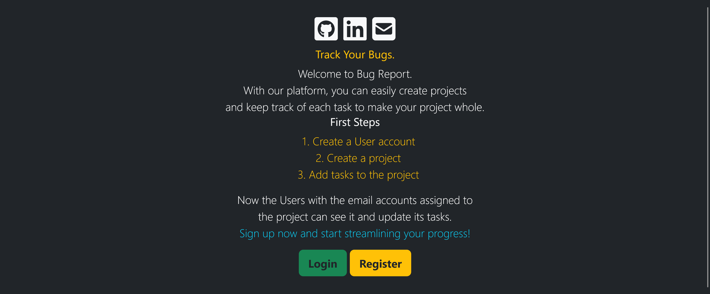
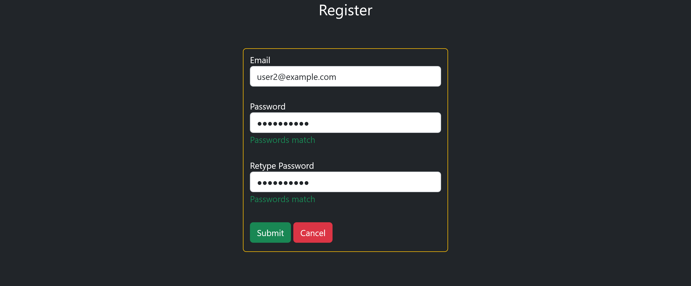
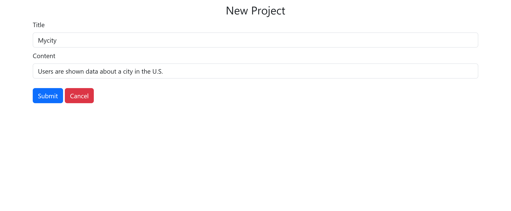
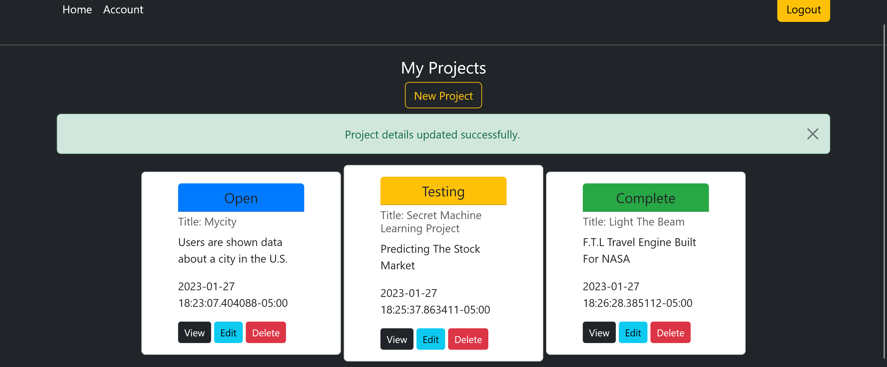
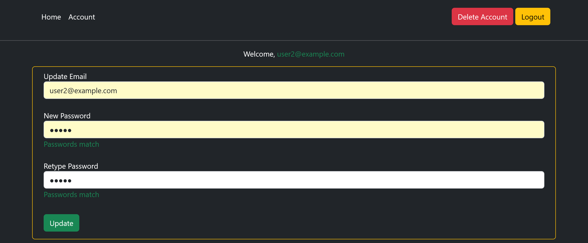
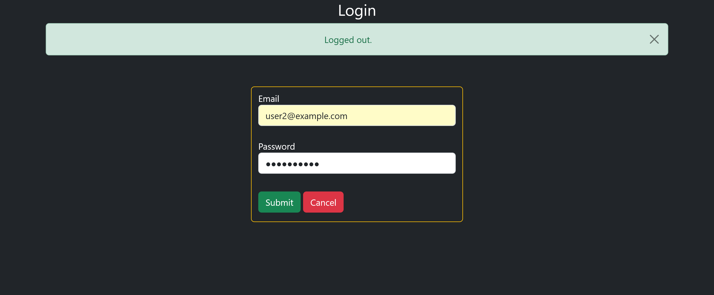

## Bug Tracker For Projects
(COMPLETED)

## [The App's Website](https://bugger.pythonanywhere.com/)
Python VERSION
* Python 3.10.4

Users can create/edit/delete projects, each with tasks/bugs of their own. The backend is served with Flask and the frontend styled with Bootstrap.

This is the homepage.

Register your account.

Create new projects.

View the project dashboard.

View the tasks dashboard.

Go to Account to update the user's information.

Login using your new information.
